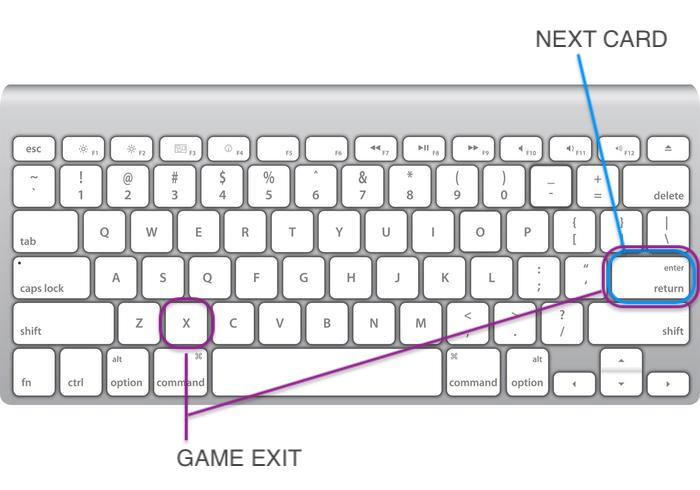
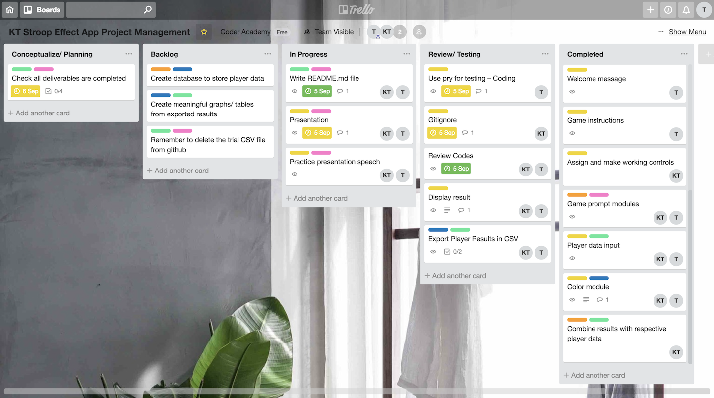

# RubiStroopie Game
----
RubiStroopie Game is a quick simple terminal game build using Ruby4.2.1. This game is adapted from a widely recognised phenomenon in psychology, called Stroop Effect. 

The Stroop Test assesses your mind's processing speed when there's interference by measuring your reaction time. This adaptation of the Stroop game has a focus on tracking the effects of meditation on stress, allowing players to track their progress before and after meditation sessions.

## Contents
- Game Mechanism
    - How game works
    - Keyboard controls
- The Psychology Behind
- Trello Board
- Ruby Gems
    - What we used
    - How we used them
    - Links to them
- Planning and Considerations
    - App Considerations
    - evidence of having considered harm/offensive outcomes
    - discussion on potential legal/ moral/ethical/cultural/safety issues
    - Consider accessibility according to WCAG standard
- Code Structure
    - modules used/ methods/ separate files
    - how we tried to keep it dry
- Challenges
    - How problems we encountered
    - How they were overcome/ compromised
    - testing using pry (3 specs)
- Presentation Slides
- Project Future
    - how project may be extended and worked upon beyond this project
    - broader societal impact of app
    - most of the possible social/ political/ cultural/ racial/ gender/ international issues
- References
    - Psych references
    - Consideration references
    - Accessibility standard references
    - Gem references

---

## RubiStroopie Game Mechanism
This game uses words in colored font as shown below. The goal of the game is to correctly say out loud the font color of each card, but not read the word. 

There are 2 rounds, each with a set of 15 words. 

**Round 1**
Baseline round that tests players reaction time without interference (i.e. font color matches the word)
 💬 Say: *"BLUE"*

**Round 2**
Stroop round that tests players reaction time with interference (i.e. font color does not match the word)
 💬 Say: *"PURPLE"*

Both rounds are timed in seconds, and data is recorded for tracking and comparison. 

To move from one card to another, the player use the [Enter] on their keyboard. To players to exit and end the game early players use the [x]+[Enter] key on their keyboard to close to program.

We encourage players to use this test before and after meditation and over a period of time to track their stress levels and effectively of meditation. 

## The Psychology Behind 
The Stroop effect is one of the best known phenomenon in cognitive science. It occurs when you must say the font color of a word, but ignoring the actual word. It usually takes longer when the word and its font color are conflicting.

This test assesses the delayed reaction ties when the color of the word doesn't match the name of the word. It's easier to say the color of a word when it matches its semantic meaning of the word, but when they are conflicting it takes longer. 

This demonstrates the effet that interference can have when it comes to reaction time in our environment. There are three theories that explain this phenomenon:
- **Selective Attention Theory**: accepts naming font color requires more attention than reading the word
- **Speed Processing Theory**: assumes our brain read words faster than name font color
- **Automaticity**: considers reading as an automatic process that's unintentional, uncontrolled, unconscious and fast. People can't choose to "turn-off" this process, whereas font color naming is a less automated process, so more attentional resource is needed which slows down our reaction time.

The Stroop effect is named after *John Ridley Stroop*(1929), who first recognised the association of our cognitive processing affected by interference by looking at our reaction time.

## Trello Board

Trello was used from early state conceptualization through to the finalized product. It was an easy and effective project management tool we used to manage and prioritized our tasks.

## Ruby Gems

## Planning 

#### Game Development Considerations
- **Player Data Recorded** - a number of data is recorded for flexible tracking purposes (name, age, gender, stress level, meditative state, test date, baseline test start time, baseline test time duration, stroop test start time, stroop test time duration). There are some data which we paid special consideration with foresight to future purpose, or for better UX design.
    - **Age** - data entry has been constrained to integers only, and between the ages of 3 to 120. After some research the average child starts to be more proficient in reading from the age of 5-6, but some some cases of prodigy children begin reading at the age of 3. The ceiling age was set by 
    - **Gender** - we wanted to ensure that this data is all encampassing in terms of diversity. After thorough research, we have used a socially aware list for players to select from. After testing out a few different methods of data entry, we decided on using a fixed multiple choice list to control valid data entry.
    - **Stress Level** - we want to allow users to easily rate their perceived state of stress. To ensure a quick and measure we kept the scale within a 5-points scale. With research we've found that market researched found that started from '0' point were more accurately scored than questionnairs that started at '1', to reduce users to misunderstand which end of the scale represents the highest positive score.
    -  **Meditative State** - We wanted to control the level of effectiveness that's found post meditation within an hour of any meditation session. This aligns players results to gather reliable data for longitudinal tracking.
    -  **Date** - We wantd to gather date for ease of player's tracking over time
    -  **Start times** - This data could be further processed if the player is interested in measuring their cognitive selective attention comparing between morning, afternoon, or evening periods by grouping the time. However this it preliminary data gather which can repurposed for selectice data tracking.
  
- **Keyboard Controls**
    - When designing game play we explored other versions of Stroop Effect tests. There were versions that required players to press 4 keys (each corresponding to the first letter of the answer e.g. [r] for RED, and [b] for BLUE) which checks the correctness of their answers. However, after further reading and consideration, this method adds another layer of varying degree inteference to their processing speed. Another method we considered was for players to have to type out the word accurately, but this again may test a player's typing speed capabilities rather than the Stroop Test's true purpose focussed on processing time. Hence we decided on using a single key for players to minimize confounding factors.
- **Exit Strategy**
    - We wanted to allow players to exit the game during the Stroop game, and including an key which enables them to.
- **Meditation**
    - Encourages players to track their progress through and cognitive processing time when under different states of stress and meditative states. At the end we recommend players to keep tracking their progress when tested under before or after meditation. This can become a simple and easy tool for anyone to check and the effectiveness of various meditation techniques. 

#### Community Impact Considerations
- Potential harmful/offensive/immoral outcomes:
    - This game uses very friendly and uses clean child-friendly language which should not cause any offensive outcomes. 
- Potential legal/ethical issues:
    - This test has been widely adapted into multiple variations from emotional, to musical versions. There are no copywrite issues in modelling a Terminal game from this widely used cognitive psychology test in this manner. The name RubiStroopie is not a registered business name so, and there are no legal issues in using such a name. We also only recommend players to use this terminal game to track whether their perceived stress level and meditative stress, and mainly for some fun. This game should not pose any legal or ethical issues.
- Potential cultural concerns:
    - For this game to be adapted more widely across cultures, in the future the game could create more versions across languages. The Stroop test's effects has been replicated in the past to also work effectively in other cultures, however in the current version of RubiStroopie we only have an English version at the moment.

## The Future of RubiStroopie
There are many versions of the Stroop effect that can be adapted. 
